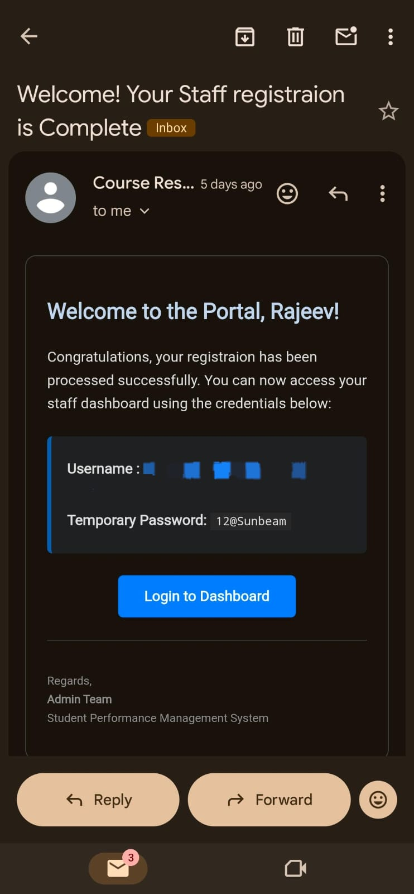

# 🎓 Student Performance Monitoring System (SPMS)

> *A centralized, automated, and transparent digital platform for managing academic performance across PG Diploma courses.*

---

## 📖 The Story Behind SPMS

Tracking student performance across multiple intensive diploma courses using traditional paper-based methods or complex spreadsheets is a nightmare. It leads to calculation errors, delayed results, and a lack of transparency for the students. 

**Enter the Student Performance Monitoring System (SPMS).**

SPMS is a standalone, web-based platform designed to digitize the entire academic evaluation lifecycle. From automated student enrollment and strict deadline management to real-time rank generation and digital mark sheets, SPMS takes the heavy lifting out of academic administration.

---

## ✨ Key Features at a Glance

* **Role-Based Access Control (RBAC):** Distinct, secure environments for Administrators, Staff, and Students.
* **Automated Enrollment:** Generates unique 12-digit Permanent Registration Numbers (PRNs) and automatically emails login credentials.
* **Strict Deadline Enforcement:** Grading tasks assigned to staff lock automatically once the deadline passes.
* **Dynamic Ranking:** System-generated student rankings based on total marks (with alphabetical tie-breakers).
* **Multi-Course Support:** Native support for various PG Diploma courses (PG-DAC, PG-DMC, PG-DBDA, PG-DESD, PG-DITIIS).

---

## 🛠️ Deep Dive: The User Experience

SPMS is built around three core user journeys, ensuring everyone gets exactly the tools they need.

### 1. The Student Portal: Empowering the Learner
Students need quick, transparent access to their academic standing. The Student Dashboard provides a clean overview of their enrolled subjects, batch group, and overall rank. 

*The centralized Student Dashboard.*

Students have full control over their personal profiles, allowing them to update their contact details and profile pictures securely.

*Profile management tailored for students, keeping sensitive data like PRNs locked down.*

The heart of the student experience is the **Performance Card**. Here, students can view their detailed digital mark sheet, broken down by Theory, Lab, and Internal assessments, alongside their pass/fail status and overall score.

*Detailed, transparent academic feedback.*

### 2. The Staff Portal: Streamlined Grading

Faculty members shouldn't have to fight with messy spreadsheets. The Staff Dashboard prioritizes action, instantly showing pending tasks and upcoming grading deadlines.

*Staff dashboard highlighting priority action items and deadline progress.*

Staff can view their specific task assignments based on the subjects and batch groups they manage.

*Clear visibility into assigned grading tasks and timelines.*

Entering marks is fast and intuitive. The system handles the final score calculations instantly based on the entered Theory, Lab, and Internal marks.

*Efficient batch-grading interface.*

### 3. The Administrator Controls

SPMS is built around three core user journeys, ensuring everyone—from the admin team to the students—gets exactly the tools they need. All users securely access the platform through a centralized login gateway.

*Centralized and secure login gateway.*

The Admin module is the powerhouse of SPMS. It provides a comprehensive dashboard summarizing system health, active courses, total user counts, and pending task statuses.

*The Administrator Dashboard provides a high-level overview of all academic activities.*

**Academic Configuration:** Admins have full control over the academic structure. They can easily configure specific subjects, assign maximum marks for grading components, and organize students into specific batch groups.

*Flexible course, subject, and batch group management.*

**Frictionless Enrollment & Automation:** Adding new staff or enrolling students is completely streamlined. The admin simply inputs basic details, assigns the relevant course, and SPMS handles the rest—including generating a unique 12-digit PRN for students and automatically firing off an email with temporary login credentials.

*Automated password generation and enrollment processes.*

*Automated email dispatch delivering secure credentials directly to the user's inbox.*

---

## 🧮 How Grading Works

SPMS uses a strict, standardized grading logic mapped to system configurations. By default, each subject carries a total of **100 marks**, distributed as follows:

* **Theory:** 40 Marks
* **Lab:** 40 Marks
* **Internal Assessment:** 20 Marks

**Passing Criteria:** A student must score a minimum of **40% in every single component** to pass. If a student meets this requirement, their status is evaluated as **Pass (P)**. Failing to reach the minimum threshold in *any* individual component results in a **Fail (F)** status for that subject.

---

## 🚀 Future Roadmap

We are continuously evolving SPMS. Planned future enhancements include:
* 📊 **Graphical Performance Analysis:** Visual charts for historical trend analysis.
* 📄 **Exportable Reports:** One-click downloads for Admin subject-wise and course-wise reports in PDF/Excel formats.
* 📱 **Mobile Application:** Native apps for on-the-go access.
* 👪 **Parent Access Module:** Dedicated portal for guardians to track student progress securely.

---

*Built for academic excellence and administrative efficiency.*

---

## 🧮 How Grading Works

SPMS uses a strict, standardized grading logic. Each subject carries a total of **100 marks**, distributed as follows:

* **Theory:** 40 Marks
* **Lab:** 40 Marks
* **Internal Assessment:** 20 Marks

**Passing Criteria:** A student must score a minimum of **40% in every single component** to pass. If a student meets this requirement, their status is **Pass (P)**. Failing to reach 40% in *any* component results in a **Fail (F)** status for that subject.

---

## 🚀 Future Roadmap

We are constantly looking to improve SPMS. Planned future enhancements include:
* 📊 **Graphical Performance Analysis:** Visual charts for historical trend analysis.
* 📄 **Exportable Reports:** One-click downloads for PDF and Excel result reports.
* 📱 **Mobile Application:** Native apps for on-the-go access.
* 👪 **Parent Portal:** Dedicated access for guardians to track student progress.

---

*Built for academic excellence.*
